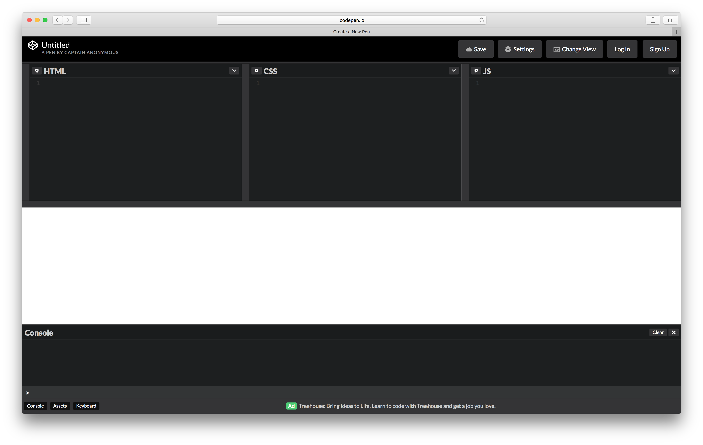
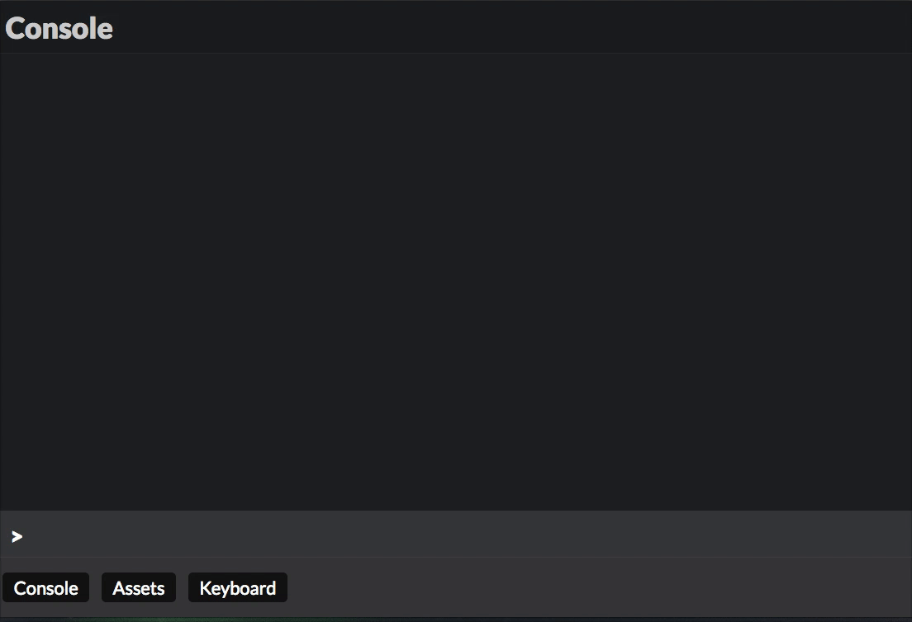

# JavaScript Core 1


**What we will learn today?**

- Getting started with JavaScript
- Simple data types and expressions
- Variables, assignment and comparison
- Conditionals: If/else, switch, ternary operator
- Arrays
- Loops: for, while
- Objects

---

## Getting started with JavaScript

We will spend most of this lesson in Codepen. To get started, go to [codepen.io/pen/](codepen.io/pen/) to create a new Pen. On the bottom left, click the "Console" button to open the console.



You can place your cursor right behind the `>` sign. Type a simple expression, such as `2 + 2` and hit enter. You will see expression, as well as its result, in the window above.



You will be able to follow most of this session along just entering expressions in the console like this.

## Simple data types & Expressions

### Numbers

Let’s start with something seemingly simple - numbers. Here are some:

```js
1
15
3195803798
1.4
0.0000005
0
-23
```

You will see that there are whole numbers (no decimal point) and real numbers (decimal point), which in JavaScript are so-called “floating point” numbers. Numbers can be positive or negative and they support all the basic math operators that you would expect:

```js
2 + 2 // 4
2 - 5 // -3
2 * 3 // 6
10 / 2 // 5
3 * -2 // -6
```

Operators have the same precedence as in algebra: `*` and `/` have higher precedence than `+` and `-`.

- **TODO:** Do math exercise
- **TODO:** What about Infinity, Math.PI, IEEE floating point bullshit, NaN

### Strings

Strings represent any sort of text. They are delimited by single quotes (`'`) or double quotes (`”`) and can be of any length.

```
'' // empty string
"" // empty string
'Hello'
'I am learning JavaScript'
'It\'s been a great journey so far!'
"Double quotes work as well"
```

> If you need single or double quotes *inside the string*, you need to “escape” them by putting a backslash in front of them. If you don’t do this, the JavaScript engine will think the string ends here, because it encounters a quote.

The most common operation on strings is to append one string to another. This is called *string concatenation*. It’s achieved by the plus (`+`) operator:

```
"Hello" + "World" // "HelloWorld"
```

- **TODO:** Introduce string concatenation
- **TODO:** What about basic string functions, like substr, replace etc?

### Booleans

[Booleans](https://en.wikipedia.org/wiki/Boolean_data_type) are a data type that can only have two values: `true` and `false`.

Like numbers, they can be combined using operators, but there are different operators for booleans (analoguous to [Boolean algebra](https://en.wikipedia.org/wiki/Boolean_algebra)). The most important ones are:

- `!` (NOT), which negates a value:
```js
!true // false
!false // true
```
- `&&` (AND), which is only true if both operands are true:
```js
false && false // false
true && false // false
false && true // false
true && true // true
```
- `||` (OR), which is true if at least one of the operands is true:
```js
false && false // false
true && false // true
false && true // true
true && true // true
```

**TODO:** When to introduce truthiness and falsiness? Probably in `comparisons`?

* * *

> **Exercise**: Put simple mathematical expressions into the console: `2 * 2`, `2 + 2`, `5 * 7 - 13`
> **Exercise**: Calculate the area of a circle (`r * r * pi`). Do a quick Google search on how to use PI in JavaScript.

> See what happens when you "add" two strings together

> Research the JS Math library. sqrt, floor, ceil, round

> Write an expression that outputs the percentage of students who are female. Make it so it outputs it as `58%`, and make sure you use the actual numbers of women and the total number of students.
> Solution: `console.log(Math.round(7 / 17 * 100) + "%");`

### From REPL to console.log

- Single expressions are not very useful, you want to write applications
- More than one statement? Move it to the `JS` box in Codepen
- Now you don't get any immediate feedback
- Use `console.log` to print to the console: `console.log(3 + 3);`
- Write statements below each other

> **THOUGHT:** Codepen does not have a "run" button, so it's quite intransparent when it actually re-runs a program. Maybe a different tool is better? A simple jsbin configuration, maybe?

### Variables and assignments

For an expression or a value to be of any use to us, we need to store it in a variable.

Variables have a name (*identifier*) that we can use to refer to a value. You can assign a value to a variable with the following statement:

```
var x = 3;
^   ^ ^ ^
|   | | value
|   | assignment operator
|   identifier
declaration statement
```

Let’s break this statement down:

- `var`: With the `var` statement we tell the JavaScript engine that `x` is now a variable
- `x`: The variable name/identifier. It can be short or long, but must not contain spaces and must not start with a number.
- `=`: The equal sign is the assigmnent operator
- `3`: The value that we assign to the variable. This can be any number, string or boolean, or any more complex data type that we will introduce later. You can also use an existing variable here.
- `;`: THe semicolon is not strictly needed, but is generally used to terminate a statement.

Now you can use the identifier instead of the actual value in an expression:

`x + x`, `x * x`, `console.log(x)`

## Conditionals

**TODO**

### Comparisons

**TODO**

- Introduce `==` and `!=`, `<` and `>`
- Introduce the concept of truthiness and falsiness for non-boolean types
- Introduce `===` and `!==`

### If/Else

**TODO**

### Switch

**TODO**

### The ternary operator

**TODO**

## Arrays

If you want to store a bunch of things, identifiers like `name1`, `name2`, `name3` and so on quickly become tiresome. **Arrays** to the rescue!

Imagine an array like a list of variables, but instead of each variable having its own name, only the array has a name. So how do you access a variable inside, then? How do you read and write? Using an *index*!

An index is just a whole number, such as `0`, `1`, `2` and so forth. As in many areas of computing, indices in JavaScript arrays start with `0` --- so `0` is the index of the first element of an Array, `1` is the index of the second element, and so forth.

### Creating an array

The easiest way to create an array is using the bracket (`[]`) syntax. Just put whatever elements you want in your array between the brackets, separated by comma:

```js
// Arrays can hold any data type
var countries = ['Scotland', 'Germany', 'Syria'];
var numbers = [7, 1, 23, 19, 11, 5, 16, 31];

// Data types can be mixed, but be wary of that!
var mixed = ['Tim', 27];

// Arrays can also be empty
var emptyArray = [];
```

### Reading, writing and length

Once you have an array, you might want to read values from it. You do this also using brackets, placed directly behind the array's variable name (identifier). The brackets hold the index of the element you want to read.

```js
var countries = ['Scotland', 'Germany', 'Syria'];

// Remember, the first index is 0
console.log(countries[0]); // 'Scotland'
console.log(countries[1]); // 'Germany'
console.log(countries[2]); // 'Syria'
```

In a similar fashion, you can write or overwrite values.

```js
var countries = ['Scotland', 'Germany', 'Syria'];

countries[1] = 'Sudan';

console.log(countries); // ['Scotland', 'Sudan', 'Syria']
```

You can also create new array elements by just writing to the respective index.

```js
var countries = ['Scotland', 'Germany', 'Syria'];

countries[3] = 'Sudan';

console.log(countries); // ['Scotland', 'Germany', 'Syria', 'Sudan']
```

You can also use other variables to store in an array, and integer variables to define the index you want to read from.

```js
var myCountry = 'Sudan';
var countries = ['Scotland', 'Germany', 'Syria', myCountry];
console.log(countries); // ['Scotland', 'Germany', 'Syria', 'Sudan']

var index = 2;
console.log(countries[index]); // 'Syria'
```

> Exercise/Homework: What happens when yo try to read from an index that is not there?

A really useful thing to know about an array is its *length*, i.e. the number of elements it contains. You can access it by appending `.length` to the arrays identifier. The length is always 1 more than the largest element index.

```js
var countries = ['Scotland', 'Germany', 'Syria'];

console.log(countries.length); // 3
```

### Useful array methods

#### Concatenating two arrays

You've learned how you can add two numbers and append two strings, but how does this work for arrays? A simple `arr1 + arr2` will not do, but there is a method you can use: `concat()`. It is a method that you call on the array (similar to how `console.log` is the `log` function called on `console`) and takes the array you want to append as a parameter.

```js
var countries = ['Scotland', 'Germany', 'Syria'];
var moreCountries = ['Sudan', 'Ethiopia', 'France'];

countries.concat(moreCountries);
console.log(countries); // ['Scotland', 'Germany', 'Syria', 'Sudan', 'Ethiopia', 'France']
```

#### Appending an element

If you want to append an element to an array, you can just put it after the last existing element like so:

```js
countries[countries.length] = 'United States of America';
```

There is another way though, which is a bit more elegant: the `push` function.

```js
countries.push('United States of America');

// .push can also be called with multiple parameters
countries.push('United States of America', 'France');
```

> Homework: Learn about `.slice` and `.pop`

There are many more useful array functions, which you will learn in lesson 2.

## Loops

**TODO**

### `for` loops

**TODO**

#### Traversing an array

By now you might have noticed that `for` loops can be really useful for working with arrays.

Imagine you want to print out every item in an array:

```js
var countries = ['Scotland', 'Germany', 'Syria'];
var i;

for(i = 0; i < countries.length; i++) {
  console.log(countries[i]);
}
```

### `while` loops

**TODO**

## Objects

**TODO**

# Resources

**TODO**

1. [Resource 1 to learn more about Topic 1](https://google.com)
2. [Resource 2 for Topic 2](https://google.com)

# Homework

**TODO**

1. First part of Homework - Easy

2. Second part of Homework - Intermediate/Hard

3. **[Bonus/Optional]** Third part/optional - Hardest

4. **Research:**

## Prepare for the next class
1. Read this [Some Tutorial or Video etc...](https://google.com)
